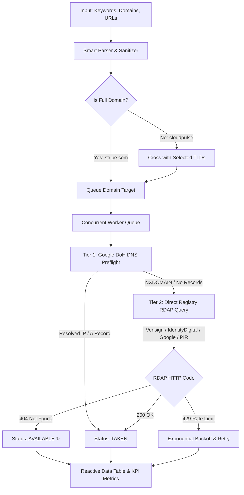

# DomainScope 🌐

<div align="center">

[](LICENSE)
[](https://react.dev/)
[](https://vite.dev/)
[](https://www.w3.org/Style/CSS/)
[](#privacy--security)
[](#how-it-works)

**Authoritative Bulk Domain Intelligence & Pricing Workbench**

*Instant, accurate domain availability checks and registry pricing intelligence without paid API keys, vendor subscriptions, or telemetry.*

[Explore Features](#-key-features) • [Quick Start](#-quick-start) • [Architecture](#-architecture--resolver-pipeline) • [Supported Extensions](#-supported-extensions-catalog) • [Documentation](#-project-structure)

</div>

---

## ⚡ Overview

**DomainScope** is an open-source, high-throughput domain intelligence tool built for founders, domain investors, developers, and naming strategists. 

Traditional domain search portals lock bulk checks behind paid API plans, rate-limit aggressively, or front-run unregistered names by capturing search telemetry. DomainScope operates **100% in your browser**—communicating directly with authoritative ICANN RDAP registries and public DNS-over-HTTPS (DoH) infrastructure.

---

## ✨ Key Features

### 🧠 Smart Unified Domain & Keyword Parser
- **Zero Mode Switching**: Paste brand keywords (e.g. `cloudpulse`), full domains (e.g. `stripe.com`), or raw URLs (e.g. `https://linear.app/features`).
- Automatically recognizes keywords vs. fully qualified domain names (FQDNs), sanitizes protocol prefixes (`https://`), strips paths, and builds target query lists dynamically.
- Drag-and-drop `.txt` and `.csv` file upload support for instant bulk imports.

### 🌐 Universal Searchable TLD Catalog (48+ Extensions)
- **Categorized Library**: Browse 48+ worldwide extensions grouped by purpose:
  - **Global & Core**: `.com`, `.co`, `.net`, `.org`, `.biz`, `.info`
  - **Tech & SaaS**: `.ai`, `.io`, `.dev`, `.app`, `.tech`, `.cloud`, `.software`, `.digital`, `.sh`, `.so`, `.bot`, `.code`
  - **Creative & Modern**: `.xyz`, `.me`, `.design`, `.studio`, `.space`, `.site`, `.online`, `.world`, `.pro`, `.link`, `.live`, `.art`
  - **Business & Commerce**: `.store`, `.shop`, `.agency`, `.company`, `.ltd`, `.services`, `.solutions`, `.finance`, `.capital`
  - **Regional (ccTLDs)**: `.in`, `.co.in`, `.co.uk`, `.uk`, `.ca`, `.de`, `.eu`, `.us`, `.ch`, `.nl`, `.fr`, `.au`
- **Dynamic Custom TLD Creator**: Type *any* extension in the world (e.g., `.club`, `.fm`, `.gg`) and press <kbd>Enter</kbd> to add and check it immediately.
- **Preference Persistence**: User selections and custom extensions are automatically preserved in browser `localStorage`.

### 🛡️ Two-Tier Authoritative Resolver Engine
- **Tier 1 (Instant Preflight ~30ms)**: Queries Google DNS-over-HTTPS (DoH) to instantly identify resolving domains and active web properties without hammering registry endpoints.
- **Tier 2 (Authoritative RDAP)**: Routes directly to verified registry RDAP endpoints (Verisign, Identity Digital, Google Registry, Public Interest Registry) to deliver binding availability confirmations.
- **Rate-Limit Resilience**: Jittered exponential backoff and user-selectable concurrency throttling (3, 5, or 8 parallel workers) prevent IP bans.

### 📊 Real-Time Workbench & Metrics
- **Interactive KPI Dashboard**: Live counters for Total, Available, Taken, and Error counts with one-click filter toggling.
- **Instant Search Filter**: Filter through hundreds of checked results in real time with instant feedback.
- **Transparent Registry Pricing**: Live estimated registration costs, renewal estimates, and registry terms (e.g., `.ai` 2-year upfront minimum rule, `.dev`/`.app` mandatory HTTPS requirement).
- **RDAP Payload Inspector**: Deep-dive into raw registry JSON payloads (nameservers, registrar entity names, status flags, timestamps) with 1-click JSON copy.

### 📑 Multi-Format Export Suite
- **CSV Export**: Clean spreadsheet format with domain names, statuses, estimated registry pricing, renewal fees, and direct purchase links.
- **Vector PDF Report**: Client-side, publication-grade executive summary report generated using `jsPDF` and `jspdf-autotable`.

---

## 🏗 Architecture & Resolver Pipeline



---

## 🖥️ UI Design Philosophy

DomainScope is intentionally crafted with a **Swiss Minimalist Light Aesthetic** designed for clarity, speed, and high cognitive efficiency:

- **Typography**: Paired [Plus Jakarta Sans](https://fonts.google.com/specimen/Plus+Jakarta+Sans) for high-legibility interface typography with [JetBrains Mono](https://fonts.google.com/specimen/JetBrains+Mono) for tabular pricing figures and domain alignment.
- **Zero Distractions**: No unnecessary marketing copy, AI fluff, or decorative clutter.
- **Color Semantics**: Subtle stone backgrounds (`#f8fafc`), crisp card borders (`#e2e8f0`), restrained emerald greens for availability, and muted slate for taken domains.

---

## 🚀 Quick Start

### Prerequisites
- [Node.js](https://nodejs.org/) (v18.0.0 or higher recommended)
- `npm` or `pnpm`

### Installation

```bash
# 1. Clone the repository
git clone https://github.com/yash5775/domainscope.git

# 2. Enter project folder
cd domainscope

# 3. Install dependencies
npm install
```

### Running Locally

```bash
npm run dev
```
Open your browser at [http://localhost:3030](http://localhost:3030).

### Production Build

```bash
npm run build
```
Creates an optimized production bundle in the `dist/` directory in under 1 second.

---

## 📁 Project Structure

```
domainscope/
├── index.html                  # HTML5 entry with fonts & meta tags
├── package.json                # Project dependencies & build scripts
├── vite.config.js              # Vite server & build configuration
├── DESIGN.md                   # Detailed design system specifications
└── src/
    ├── main.jsx                # React 19 application root
    ├── App.jsx                 # Master application controller & state machine
    ├── App.css                 # Component & workbench design system styles
    ├── index.css               # Global typography, resets & CSS variables
    ├── components/
    │   ├── Header.jsx          # Top navigation bar with available domain count
    │   ├── InputPanel.jsx      # Domain inputs, searchable TLD catalog & controls
    │   ├── MetricsBar.jsx      # Live KPI metrics counters & status filters
    │   ├── ResultsTable.jsx    # Sortable results table with direct registrar links
    │   ├── InspectModal.jsx    # Raw RDAP response inspector modal
    │   └── Toast.jsx           # Non-intrusive micro-notifications
    └── services/
        └── domainEngine.js     # DNS/RDAP resolvers, TLD database & PDF/CSV exporters
```

---

## 🔒 Privacy & Security

- **No Third-Party Tracking**: DomainScope makes zero calls to analytics providers or third-party tracking scripts.
- **Front-Running Immunity**: Because searches are queried directly against ICANN registry endpoints from your own browser, domain registrars cannot monitor or front-run your searches.
- **Local Storage Only**: Your preferences and custom extensions are stored strictly in your browser's `localStorage` and never transmitted to an external server.

---

## ⌨️ Keyboard Shortcuts

| Shortcut | Action |
| :--- | :--- |
| <kbd>⌘</kbd> + <kbd>Enter</kbd> / <kbd>Ctrl</kbd> + <kbd>Enter</kbd> | Start Domain Check |
| <kbd>Esc</kbd> | Close RDAP Inspector Modal |
| <kbd>Enter</kbd> (in TLD search) | Add Custom Extension to Catalog |

---

## 🤝 Contributing

Contributions, bug reports, and suggestions are welcome!

1. Fork the Project (`https://github.com/yash5775/domainscope`)
2. Create your Feature Branch (`git checkout -b feature/NewFeature`)
3. Commit your Changes (`git commit -m 'Add NewFeature'`)
4. Push to the Branch (`git push origin feature/NewFeature`)
5. Open a Pull Request

---

## 📄 License

Distributed under the **MIT License**. See [`LICENSE`](LICENSE) for more information.

<div align="center">
<sub>Crafted for speed, precision, and privacy.</sub>
</div>
